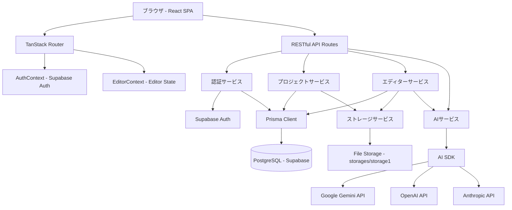
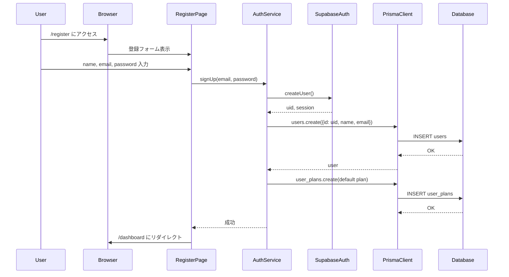
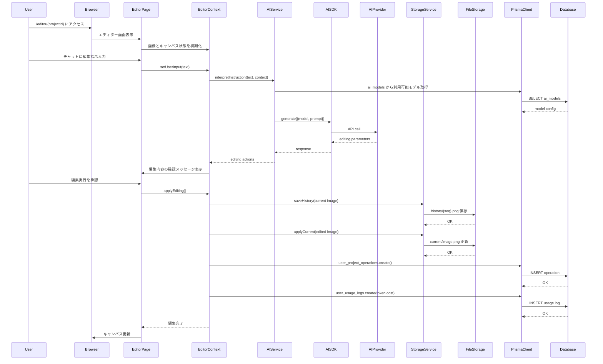
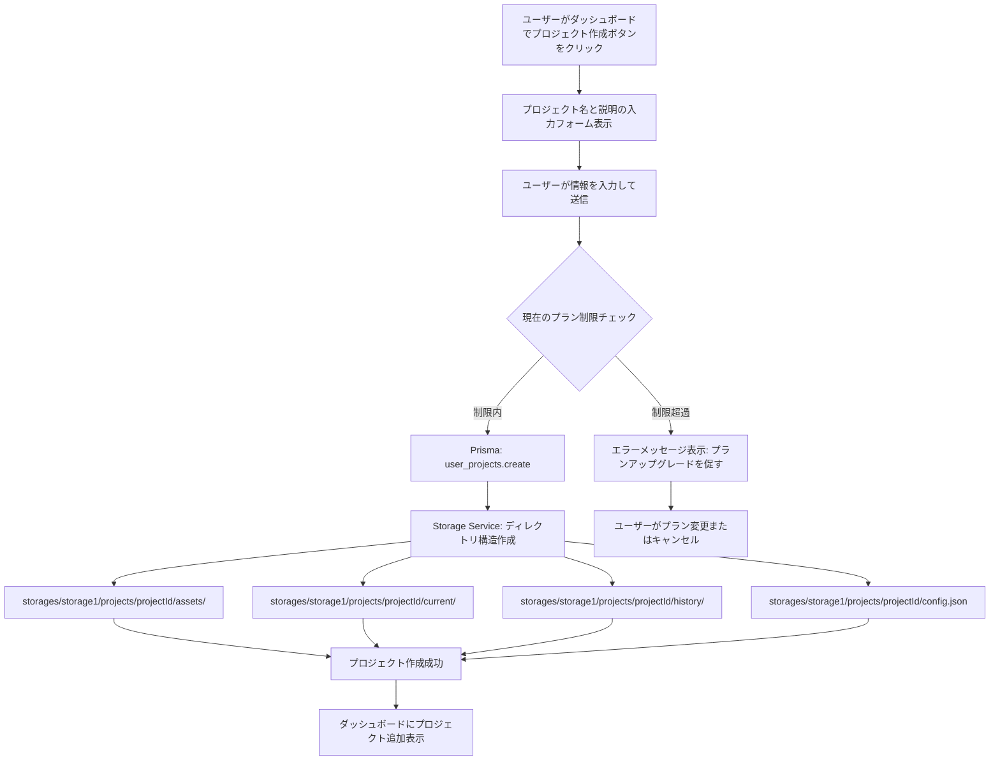
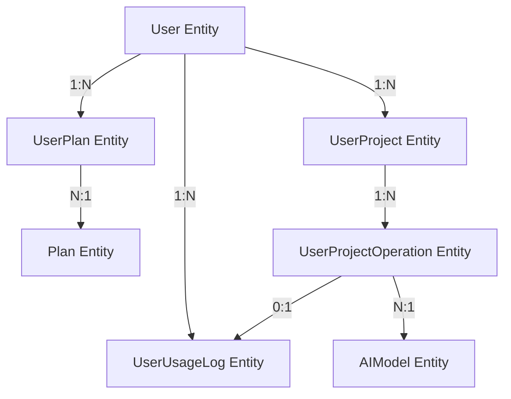

# 技術設計書

## 概要
Metamoは、AI技術を活用した画像編集Webアプリケーションです。ユーザーは自然言語によるチャット機能やビジュアルキャンバス機能を通じて、専門知識なしに高度な画像加工を実現できます。本システムは、React/TypeScript/Viteベースのシングルページアプリケーションとして構築され、RESTful APIを通じてSupabase認証、Prismaデータベース、複数のAIプロバイダ（Google Gemini、OpenAI、Anthropic）と統合されます。

**目的**: 従来の複雑な画像編集ツールを使用することなく、直感的な対話とビジュアル操作により、誰でも簡単に画像編集を行えるサービスを提供します。

**ユーザー**: 一般ユーザー、デザイナー、コンテンツクリエイターがダッシュボードからプロジェクトを管理し、エディターで画像編集を実行します。

**影響**: 完全新規開発（greenfield）プロジェクトであり、既存システムへの影響はありません。

### Goals
- React/TypeScript/Viteを用いた高速で型安全なSPAの構築
- Supabase認証とPrisma ORMによる安全で拡張可能なデータ管理
- AI SDKを使用した複数AIプロバイダのプラグイン可能な統合
- RESTful API設計による保守性と拡張性の確保
- NFSマウント対応の構造化ストレージによるスケーラビリティ

### Non-Goals
- モバイルネイティブアプリ対応（タブレット対応のレスポンシブUIのみ）
- リアルタイムコラボレーション編集（将来的な拡張候補）
- 動画編集機能（画像のみ対象）
- オフライン編集機能（常時オンライン前提）

## Architecture

### High-Level Architecture



**アーキテクチャ統合**:
- **新規プロジェクト**: 確立されたパターンなし（greenfield）
- **技術スタック整合性**: React/TypeScript/Viteエコシステムとの完全な統合
- **レイヤー分離**: プレゼンテーション層（React Components）、ルーティング層（TanStack Router）、コンテキスト層（React Context）、サービス層（Business Logic）、データアクセス層（Prisma Client）、永続化層（PostgreSQL + File Storage）

### Technology Stack and Design Decisions

本プロジェクトは完全新規開発（greenfield）であり、2025年時点での最新のベストプラクティスと型安全性を重視した技術選定を行います。

#### フロントエンド層
- **React 18.x + TypeScript 5.x**: 選定理由: 型安全性、エコシステムの成熟度、開発者コミュニティの規模。代替案: Vue 3（Composition API）、Svelte
- **Vite 5.x**: 選定理由: 高速なHMR、ESM-first、TypeScript統合。代替案: webpack、Parcel
- **TanStack Router v1**: 選定理由: 完全な型安全性、ファイルベースルーティング、自動コード分割。代替案: React Router v7、Next.js App Router
- **TailwindCSS 3.x + DaisyUI**: 選定理由: ユーティリティファーストCSS、一貫したデザインシステム、アクセシビリティ対応。代替案: CSS Modules、Styled Components

#### バックエンド層
- **RESTful API（Vite API Routes）**: 選定理由: シンプルさ、RESTful原則への準拠、既存エコシステムとの互換性。代替案: GraphQL、tRPC
- **Prisma ORM 6.x**: 選定理由: 型安全なクエリ、マイグレーション管理、PostgreSQL最適化。代替案: TypeORM、Drizzle ORM
- **Supabase Auth**: 選定理由: PostgreSQL統合、OAuth対応、RLS（Row Level Security）サポート。代替案: Auth0、NextAuth.js

#### データベース層
- **PostgreSQL (Supabase)**: 選定理由: リレーショナルデータモデル、ACID特性、Supabase統合。代替案: MySQL、MongoDB

#### AI統合層
- **Vercel AI SDK 4.2+**: 選定理由: 統一API、複数プロバイダ対応（Google、OpenAI、Anthropic）、TypeScript型安全性、推論モデル対応。代替案: 各AIプロバイダの個別SDK、LangChain

#### ストレージ層
- **ローカルファイルシステム（NFSマウント対応）**: 選定理由: シンプルさ、NFSによるスケーラビリティ、バックアップの柔軟性。代替案: S3、Supabase Storage

#### パッケージ管理
- **pnpm 10.x**: 選定理由: ディスク効率、モノレポサポート、高速インストール。代替案: npm、yarn

### 主要な設計決定

#### 決定1: AI SDKを用いた複数AIプロバイダの統一インターフェース

**Context**: ユーザーがチャットで画像編集指示を出す際、複数のAIプロバイダ（Google Gemini、OpenAI、Anthropic）を切り替え可能にし、将来的なモデル追加を容易にする必要がある。

**Alternatives**:
1. 各AIプロバイダの個別SDKを直接使用し、プロバイダごとに異なるインターフェースを実装
2. LangChainを使用し、エージェント機能を含む包括的なAI統合
3. Vercel AI SDKを使用し、統一されたインターフェースで複数プロバイダをサポート

**Selected Approach**: Vercel AI SDK 4.2+を使用
- `ai_models`テーブルにプロバイダ情報（platform: google/openai/anthropic、params: JSON）を保存
- AI SDKの統一APIを通じて動的にプロバイダを切り替え
- `@ai-sdk/google`, `@ai-sdk/openai`, `@ai-sdk/anthropic`をインストール

**Rationale**:
- AI SDK 4.2はGoogle Gemini 2.0 Flash、OpenAI gpt-4.5/o3-mini、Anthropic Claude 3.7 Sonnet（推論モデル）をサポート
- 統一されたTypeScriptインターフェースにより、プロバイダ切り替え時のコード変更を最小化
- `ai_models`テーブルに新規レコードを追加するだけで新しいモデルを利用可能
- 推論モデル（reasoning models）のサポートにより、複雑な画像編集指示の解釈精度が向上

**Trade-offs**:
- **獲得**: プロバイダ非依存の実装、将来的な拡張性、型安全性、推論モデル対応
- **犠牲**: LangChainのようなエージェント機能は別途実装が必要、AI SDKのバージョンアップへの追従

#### 決定2: TanStack Routerによるファイルベースルーティング

**Context**: React SPAのルーティングを型安全かつ保守性の高い方法で実装する必要がある。

**Alternatives**:
1. React Router v7を使用し、従来のコンポーネントベースルーティング
2. Next.js App Routerを使用し、SSR/SSGを含むフルスタックフレームワーク
3. TanStack Router v1を使用し、ファイルベースルーティングと完全な型安全性

**Selected Approach**: TanStack Router v1のファイルベースルーティング
- `app/routes/`ディレクトリ配下にルートファイルを配置
- 自動コード分割とルート型生成
- `AuthContext`と`EditorContext`をルートローダーで統合

**Rationale**:
- ファイルベースルーティングにより、ルート構造が直感的で自動コード分割が有効化
- TypeScriptの型推論により、ルートパラメータやクエリパラメータの型エラーをコンパイル時に検出
- `/editor/$userProjectId`のような動的ルートパラメータが完全に型安全

**Trade-offs**:
- **獲得**: 完全な型安全性、自動コード分割、ルート構造の可視性
- **犠牲**: React Routerと比較してコミュニティサイズが小さい、Next.jsのSSR機能は利用不可

#### 決定3: Prisma + Supabase Authによるハイブリッド認証・データ管理

**Context**: ユーザー認証とデータベース管理を統合し、セキュアで拡張可能なシステムを構築する必要がある。

**Alternatives**:
1. Supabase Authのみを使用し、データベースアクセスもSupabase Clientで実施
2. NextAuth.jsを使用し、PostgreSQLをPrismaで管理
3. Supabase AuthとPrismaを併用し、認証はSupabase、データアクセスはPrismaで分離

**Selected Approach**: Supabase Auth + Prisma ORM
- Supabase Authで認証（email/password、OAuth）
- Prisma ORMでデータベーススキーマ管理とクエリ実行
- `users`テーブルはPrismaで管理し、Supabase AuthのUIDと連携

**Rationale**:
- Supabase AuthはOAuth対応、RLS（Row Level Security）サポートによりセキュリティが向上
- Prismaは型安全なクエリとマイグレーション管理により開発体験が向上
- Transaction Pooler（ポート6543）を使用することでサーバーレス環境にも対応

**Trade-offs**:
- **獲得**: 型安全なデータアクセス、Supabaseの認証機能、マイグレーション管理
- **犠牲**: 2つのライブラリの学習コスト、Supabase Clientの一部機能（Realtime、Storage）は別途統合が必要

## System Flows

### ユーザー登録・ログインフロー



### 画像編集フロー（チャット指示）



### プロジェクト作成フロー



## Requirements Traceability

| Requirement | 要件概要 | Components | Interfaces | Flows |
|-------------|----------|------------|------------|-------|
| 1.1-1.7 | ユーザー認証とアカウント管理 | AuthService, SupabaseAuth, PrismaClient | POST /api/auth/register, POST /api/auth/login | ユーザー登録・ログインフロー |
| 2.1-2.7 | プラン管理とトークン制限 | ProjectService, PrismaClient | GET /api/users/plan, POST /api/users/usage | - |
| 3.1-3.7 | プロジェクト管理（ダッシュボード） | ProjectService, StorageService, PrismaClient | GET /api/projects, POST /api/projects | プロジェクト作成フロー |
| 4.1-4.5 | 画像のアップロードと管理 | EditorService, StorageService | POST /api/projects/{id}/assets | - |
| 5.1-5.9 | チャットベースの画像編集指示 | AIService, EditorService, AISDK, PrismaClient | POST /api/editor/interpret, POST /api/editor/apply | 画像編集フロー（チャット指示） |
| 6.1-6.6 | キャンバス機能による画像編集 | EditorContext, CanvasComponent | - | - |
| 7.1-7.6 | 編集履歴とアンドゥ・リドゥ | EditorService, StorageService, PrismaClient | GET /api/projects/{id}/operations | - |
| 8.1-8.5 | 編集結果のエクスポート | StorageService | GET /api/projects/{id}/export | - |
| 9.1-9.5 | レスポンシブUI | TailwindCSS, DaisyUI | - | - |
| 10.1-10.7 | AIモデルとの統合 | AIService, AISDK, PrismaClient | - | 画像編集フロー（チャット指示） |
| 11.1-11.7 | RESTful API設計 | API Routes, AuthService, ProjectService | 全APIエンドポイント | - |
| 12.1-12.5 | データベーススキーマとマイグレーション | Prisma Schema, Seed Script | - | - |
| 13.1-13.5 | ストレージとファイル管理 | StorageService, FileStorage | - | プロジェクト作成フロー |
| 14.1-14.6 | 開発環境とデプロイメント | Docker Compose, Vite Config | - | - |
| 15.1-15.5 | 設定画面 | SettingsPage, AuthService, PrismaClient | PATCH /api/users/{id} | - |

## Components and Interfaces

### 認証・ユーザー管理ドメイン

#### AuthService

**Responsibility & Boundaries**
- **Primary Responsibility**: ユーザー認証、セッション管理、認証状態の検証
- **Domain Boundary**: 認証ドメイン（ユーザー登録、ログイン、ログアウト、セッション管理）
- **Data Ownership**: Supabase Auth UIDとusersテーブルの連携
- **Transaction Boundary**: ユーザー登録時のSupabase Auth + users + user_plans作成をトランザクショナルに実施

**Dependencies**
- **Inbound**: RegisterPage, LoginPage, AuthContext
- **Outbound**: SupabaseAuth, PrismaClient
- **External**: Supabase Auth API

**External Dependencies Investigation**:
- Supabase Auth: `@supabase/supabase-js` v2.x を使用
- OAuth対応: Google、GitHub、GitLabなどのプロバイダをサポート
- セッション管理: JWTベースのアクセストークンとリフレッシュトークン
- RLS（Row Level Security）: PostgreSQLのRLSポリシーと統合可能
- 認証フロー: `supabase.auth.signUp()`, `supabase.auth.signInWithPassword()`, `supabase.auth.signOut()`
- セッション取得: `supabase.auth.getSession()`, `supabase.auth.onAuthStateChange()`

**Contract Definition**

**Service Interface**:
```typescript
interface AuthService {
  signUp(input: SignUpInput): Promise<Result<User, AuthError>>;
  signIn(input: SignInInput): Promise<Result<Session, AuthError>>;
  signOut(): Promise<Result<void, AuthError>>;
  getCurrentUser(): Promise<Result<User | null, AuthError>>;
  updateUser(userId: string, input: UpdateUserInput): Promise<Result<User, AuthError>>;
}

type SignUpInput = {
  name: string;
  email: string;
  password: string;
};

type SignInInput = {
  email: string;
  password: string;
};

type UpdateUserInput = {
  name?: string;
};

type AuthError =
  | { type: 'EMAIL_ALREADY_EXISTS'; message: string }
  | { type: 'INVALID_CREDENTIALS'; message: string }
  | { type: 'NETWORK_ERROR'; message: string };
```

**Preconditions**:
- signUp: emailが有効な形式、passwordが最低8文字
- signIn: emailとpasswordが入力済み
- updateUser: userIdが存在、認証済み

**Postconditions**:
- signUp成功時: Supabase Authにユーザー作成、usersテーブルにレコード作成、user_plansにデフォルトプラン関連付け
- signIn成功時: セッショントークン発行、last_login_at更新
- signOut成功時: セッション無効化

**Invariants**:
- Supabase AuthのUIDとusers.idは常に一致
- user_plansには必ず1つ以上のアクティブなプランが存在

**API Contract**:

| Method | Endpoint | Request | Response | Errors |
|--------|----------|---------|----------|--------|
| POST | /api/auth/register | { name, email, password } | { user: User, session: Session } | 400, 409, 500 |
| POST | /api/auth/login | { email, password } | { user: User, session: Session } | 400, 401, 500 |
| POST | /api/auth/logout | - | { success: true } | 401, 500 |
| GET | /api/auth/me | - | { user: User } | 401, 500 |
| PATCH | /api/users/{id} | { name? } | { user: User } | 400, 401, 404, 500 |

### プロジェクト管理ドメイン

#### ProjectService

**Responsibility & Boundaries**
- **Primary Responsibility**: プロジェクトのCRUD操作、プラン制限チェック、ストレージディレクトリ管理
- **Domain Boundary**: プロジェクト管理ドメイン（プロジェクト作成、一覧取得、更新、削除）
- **Data Ownership**: user_projectsテーブルとストレージディレクトリ
- **Transaction Boundary**: プロジェクト作成時のDB登録とストレージディレクトリ作成を一貫性保証

**Dependencies**
- **Inbound**: DashboardPage, ProjectCard
- **Outbound**: PrismaClient, StorageService
- **External**: なし

**Contract Definition**

**Service Interface**:
```typescript
interface ProjectService {
  listProjects(userId: string): Promise<Result<Project[], ProjectError>>;
  createProject(input: CreateProjectInput): Promise<Result<Project, ProjectError>>;
  updateProject(projectId: string, input: UpdateProjectInput): Promise<Result<Project, ProjectError>>;
  deleteProject(projectId: string, userId: string): Promise<Result<void, ProjectError>>;
  getProject(projectId: string, userId: string): Promise<Result<Project, ProjectError>>;
}

type CreateProjectInput = {
  userId: string;
  name: string;
  description?: string;
};

type UpdateProjectInput = {
  name?: string;
  description?: string;
};

type ProjectError =
  | { type: 'PLAN_LIMIT_EXCEEDED'; message: string; currentLimit: number }
  | { type: 'PROJECT_NOT_FOUND'; message: string }
  | { type: 'STORAGE_ERROR'; message: string };
```

**Preconditions**:
- createProject: ユーザーが認証済み、プラン制限内
- updateProject: プロジェクトが存在、ユーザーが所有者
- deleteProject: プロジェクトが存在、ユーザーが所有者

**Postconditions**:
- createProject成功時: user_projectsにレコード作成、ストレージディレクトリ作成（assets/, current/, history/, config.json）
- deleteProject成功時: deleted_atが設定（論理削除）

**Invariants**:
- 各プロジェクトは必ず1人のユーザーに所有される
- ストレージディレクトリとDB レコードは常に同期

**API Contract**:

| Method | Endpoint | Request | Response | Errors |
|--------|----------|---------|----------|--------|
| GET | /api/projects | - | { projects: Project[] } | 401, 500 |
| POST | /api/projects | { name, description? } | { project: Project } | 400, 403, 500 |
| GET | /api/projects/{id} | - | { project: Project } | 401, 404, 500 |
| PATCH | /api/projects/{id} | { name?, description? } | { project: Project } | 400, 401, 404, 500 |
| DELETE | /api/projects/{id} | - | { success: true } | 401, 404, 500 |

### エディタードメイン

#### EditorService

**Responsibility & Boundaries**
- **Primary Responsibility**: 画像編集操作の実行、履歴管理、操作記録
- **Domain Boundary**: エディタードメイン（画像アップロード、編集適用、履歴管理、エクスポート）
- **Data Ownership**: user_project_operationsテーブル、ストレージディレクトリ内の画像ファイル
- **Transaction Boundary**: 編集操作の実行時にoperationsレコード作成、usage_logs記録、ファイル保存を一貫性保証

**Dependencies**
- **Inbound**: EditorPage, EditorContext
- **Outbound**: PrismaClient, StorageService, AIService
- **External**: なし

**Contract Definition**

**Service Interface**:
```typescript
interface EditorService {
  uploadAsset(projectId: string, file: File): Promise<Result<Asset, EditorError>>;
  interpretInstruction(input: InterpretInput): Promise<Result<EditingActions, EditorError>>;
  applyEditing(input: ApplyEditingInput): Promise<Result<EditingResult, EditorError>>;
  getOperations(projectId: string): Promise<Result<Operation[], EditorError>>;
  undoOperation(projectId: string, currentSeq: number): Promise<Result<EditingResult, EditorError>>;
  redoOperation(projectId: string, currentSeq: number): Promise<Result<EditingResult, EditorError>>;
  exportImage(projectId: string, format: ImageFormat): Promise<Result<Blob, EditorError>>;
}

type InterpretInput = {
  projectId: string;
  userId: string;
  instruction: string;
  canvasContext?: CanvasContext;
};

type ApplyEditingInput = {
  projectId: string;
  userId: string;
  actions: EditingActions;
  currentImagePath: string;
};

type CanvasContext = {
  selectedRegion?: { x: number; y: number; width: number; height: number };
  clickedPosition?: { x: number; y: number };
};

type EditingActions = {
  operations: Array<{
    type: 'crop' | 'filter' | 'adjust' | 'transform';
    params: Record<string, unknown>;
  }>;
};

type EditingResult = {
  imageUrl: string;
  sequenceNumber: number;
  operationId: string;
};

type ImageFormat = 'jpeg' | 'png' | 'webp';

type EditorError =
  | { type: 'ASSET_TOO_LARGE'; message: string; maxSize: number }
  | { type: 'UNSUPPORTED_FORMAT'; message: string; supportedFormats: string[] }
  | { type: 'AI_ERROR'; message: string }
  | { type: 'STORAGE_ERROR'; message: string };
```

**Preconditions**:
- uploadAsset: ファイルサイズが10MB以下、サポート形式（JPEG、PNG、WebP）
- interpretInstruction: プロジェクトが存在、ユーザーが所有者
- applyEditing: 編集アクションが有効、currentImagePathが存在

**Postconditions**:
- uploadAsset成功時: assets/ディレクトリにファイル保存、config.jsonにメタデータ記録
- applyEditing成功時: current/に新しい画像保存、history/に前の画像保存、user_project_operationsにレコード作成、user_usage_logsにトークン記録

**Invariants**:
- sequence_numberは常に一意かつ連番
- history/内のファイル名は{sequence_number}.{ext}形式

**API Contract**:

| Method | Endpoint | Request | Response | Errors |
|--------|----------|---------|----------|--------|
| POST | /api/projects/{id}/assets | FormData(file) | { asset: Asset } | 400, 413, 500 |
| POST | /api/editor/interpret | { projectId, instruction, canvasContext? } | { actions: EditingActions } | 400, 500 |
| POST | /api/editor/apply | { projectId, actions, currentImagePath } | { result: EditingResult } | 400, 500 |
| GET | /api/projects/{id}/operations | - | { operations: Operation[] } | 401, 404, 500 |
| POST | /api/editor/undo | { projectId, currentSeq } | { result: EditingResult } | 400, 500 |
| POST | /api/editor/redo | { projectId, currentSeq } | { result: EditingResult } | 400, 500 |
| GET | /api/projects/{id}/export | ?format=jpeg\|png\|webp | Blob | 400, 404, 500 |

#### AIService

**Responsibility & Boundaries**
- **Primary Responsibility**: AI APIとの統合、指示の解釈、編集パラメータの生成、トークン消費の記録
- **Domain Boundary**: AI統合ドメイン（自然言語処理、画像編集パラメータ生成）
- **Data Ownership**: ai_modelsテーブル、user_usage_logsテーブル
- **Transaction Boundary**: API呼び出しとusage_logs記録を一貫性保証

**Dependencies**
- **Inbound**: EditorService
- **Outbound**: AISDK, PrismaClient
- **External**: Google Gemini API, OpenAI API, Anthropic API

**External Dependencies Investigation**:
- **Vercel AI SDK 4.2+**: `ai`, `@ai-sdk/google`, `@ai-sdk/openai`, `@ai-sdk/anthropic`をインストール
- **Google Gemini API**: Gemini 2.0 Flashは画像生成対応、Vertex AIでプロンプトキャッシング対応
- **OpenAI API**: gpt-4.5、o3-mini（推論モデル）、Responses API、PDF入力対応
- **Anthropic API**: Claude 3.7 Sonnet（推論モデル）、bash/text editor/computerツール対応
- **認証**: 各プロバイダのAPIキーを環境変数で管理（GOOGLE_API_KEY、OPENAI_API_KEY、ANTHROPIC_API_KEY）
- **レート制限**: 各プロバイダのレート制限に応じてリトライロジックを実装
- **トークン消費**: response.usage.totalTokensをuser_usage_logsに記録

**Contract Definition**

**Service Interface**:
```typescript
interface AIService {
  interpretInstruction(input: InterpretInstructionInput): Promise<Result<EditingActions, AIError>>;
  getAvailableModels(userId: string): Promise<Result<AIModel[], AIError>>;
  recordUsage(input: RecordUsageInput): Promise<Result<void, AIError>>;
}

type InterpretInstructionInput = {
  userId: string;
  instruction: string;
  canvasContext?: CanvasContext;
  modelId?: string;
};

type RecordUsageInput = {
  userId: string;
  projectOperationId?: string;
  cost: number;
  aiModel: string;
  usage: string;
};

type AIModel = {
  id: string;
  name: string;
  platform: 'google' | 'openai' | 'anthropic';
  params: Record<string, unknown>;
};

type AIError =
  | { type: 'TIMEOUT'; message: string }
  | { type: 'RATE_LIMIT'; message: string; retryAfter: number }
  | { type: 'API_ERROR'; message: string }
  | { type: 'QUOTA_EXCEEDED'; message: string };
```

**Preconditions**:
- interpretInstruction: instructionが非空、ユーザーのトークン残量が十分
- recordUsage: costが正の数

**Postconditions**:
- interpretInstruction成功時: EditingActionsを返す、user_usage_logsにトークン消費を記録
- recordUsage成功時: user_usage_logsにレコード作成

**Invariants**:
- ai_modelsテーブルには常に少なくとも1つのアクティブなモデルが存在
- user_usage_logsのcostは常に0以上

**Integration Strategy**:
- AI SDK統一インターフェースを使用し、プロバイダ切り替えをai_models.platformで動的に実施
- プロンプトテンプレートは`app/prompts/`ディレクトリで管理し、編集指示解釈用のシステムプロンプトを定義

### ストレージ管理ドメイン

#### StorageService

**Responsibility & Boundaries**
- **Primary Responsibility**: ファイルシステム操作、ディレクトリ管理、画像の保存・読み込み
- **Domain Boundary**: ストレージドメイン（ファイルアップロード、ディレクトリ作成、履歴管理）
- **Data Ownership**: storages/storage1/projects/配下のファイルとディレクトリ
- **Transaction Boundary**: なし（ファイルシステム操作はアトミックでない）

**Dependencies**
- **Inbound**: ProjectService, EditorService
- **Outbound**: FileStorage（Node.js fs module）
- **External**: なし（将来的にはNFSマウント、S3対応も想定）

**Contract Definition**

**Service Interface**:
```typescript
interface StorageService {
  createProjectDirectory(projectId: string): Promise<Result<void, StorageError>>;
  saveAsset(projectId: string, file: File): Promise<Result<string, StorageError>>;
  saveCurrent(projectId: string, imageData: Buffer): Promise<Result<string, StorageError>>;
  saveHistory(projectId: string, sequenceNumber: number, imageData: Buffer): Promise<Result<string, StorageError>>;
  loadCurrent(projectId: string): Promise<Result<Buffer, StorageError>>;
  loadHistory(projectId: string, sequenceNumber: number): Promise<Result<Buffer, StorageError>>;
  updateConfig(projectId: string, config: ProjectConfig): Promise<Result<void, StorageError>>;
  getConfig(projectId: string): Promise<Result<ProjectConfig, StorageError>>;
}

type ProjectConfig = {
  imageMetadata?: {
    width: number;
    height: number;
    format: string;
  };
  usedAIModels?: string[];
  settings?: Record<string, unknown>;
};

type StorageError =
  | { type: 'DIRECTORY_NOT_FOUND'; message: string }
  | { type: 'FILE_NOT_FOUND'; message: string }
  | { type: 'WRITE_ERROR'; message: string }
  | { type: 'READ_ERROR'; message: string };
```

**Preconditions**:
- saveAsset: プロジェクトディレクトリが存在
- saveCurrent/saveHistory: imageDataが有効なBuffer
- loadCurrent/loadHistory: ファイルが存在

**Postconditions**:
- createProjectDirectory成功時: `assets/`, `current/`, `history/`, `config.json`が作成される
- saveHistory成功時: `history/{sequenceNumber}.{ext}`が保存される
- updateConfig成功時: `config.json`が更新される

**Invariants**:
- ディレクトリ構造は常に `storages/storage1/projects/{projectId}/{assets|current|history}/` 形式
- config.jsonは常にJSON形式で有効

**State Management**:
- ストレージパスルートは環境変数`STORAGE_ROOT`で設定可能（デフォルト: `storages/storage1`）
- NFSマウントの場合、環境変数で別パスを指定

## Data Models

### Domain Model

本システムの中核ドメインは「ユーザー」「プロジェクト」「編集操作」「プラン」「AI モデル」で構成されます。

**Core Concepts**:
- **Aggregates**:
  - User Aggregate（users、user_plans）: ユーザーとプランのトランザクショナル境界
  - Project Aggregate（user_projects、user_project_operations）: プロジェクトと操作履歴のトランザクショナル境界
- **Entities**:
  - User: ユーザーアカウント（id、name、email）
  - Plan: サブスクリプションプラン（cost_limit、create_project_count）
  - UserProject: プロジェクト（name、description、created_at）
  - UserProjectOperation: 編集操作（sequence_number、type、process_json、actions_json）
  - AIModel: AIモデル設定（platform、params）
- **Value Objects**:
  - BillingPeriod: 請求期間（current_period_started_at、current_period_ended_at）
  - OperationType: 操作タイプ（chat、code、data、visual、wizard）
- **Domain Events**:
  - ProjectCreated: プロジェクト作成時
  - OperationApplied: 編集操作適用時
  - TokenQuotaExceeded: トークン上限到達時

**Business Rules & Invariants**:
- ユーザーは必ず1つ以上のアクティブなプランを持つ（user_plans.status_type = 1）
- プロジェクト操作のsequence_numberは連番かつ一意
- トークン消費合計がcost_limitを超えた場合、AI機能は制限される
- プロジェクト削除は論理削除（deleted_atを設定）
- prev_sequence_numberは履歴の分岐を管理（ブランチ履歴）



### Physical Data Model

**Relational Database (PostgreSQL - Supabase)**

#### usersテーブル
```prisma
model User {
  id              String   @id @default(uuid())
  name            String
  email           String   @unique
  password_hash   String
  last_login_at   DateTime?
  created_at      DateTime @default(now())
  updated_at      DateTime @updatedAt

  user_plans      UserPlan[]
  user_projects   UserProject[]
  user_usage_logs UserUsageLog[]
}
```

#### plansテーブル
```prisma
model Plan {
  id                         String   @id @default(uuid())
  name                       String
  billing_interval_term_type Int      // 0:無制限, 1:日, 2:月, 3:年
  billing_interval_count     Int
  cost_reset_term_type       Int      // 1:日, 2:月, 3:年
  cost_limit                 BigInt
  create_project_count       Int
  created_at                 DateTime @default(now())
  updated_at                 DateTime @updatedAt

  user_plans                 UserPlan[]
}
```

#### user_plansテーブル
```prisma
model UserPlan {
  id                        String   @id @default(uuid())
  user_id                   String
  plan_id                   String
  next_plan_id              String?
  started_at                DateTime
  ended_at                  DateTime?
  billing_cycle_anchor_date DateTime
  current_period_started_at DateTime
  current_period_ended_at   DateTime
  is_auto_renew             Boolean  @default(true)
  status_type               Int      // 1:アクティブ, 2:キャンセル, 3:終了
  canceled_at               DateTime?
  created_at                DateTime @default(now())
  updated_at                DateTime @updatedAt

  user                      User     @relation(fields: [user_id], references: [id])
  plan                      Plan     @relation(fields: [plan_id], references: [id])

  @@index([user_id])
  @@index([plan_id])
}
```

#### user_projectsテーブル
```prisma
model UserProject {
  id                     String   @id @default(uuid())
  user_id                String
  name                   String
  description            String?
  created_at             DateTime @default(now())
  updated_at             DateTime @updatedAt
  deleted_at             DateTime?

  user                   User     @relation(fields: [user_id], references: [id])
  user_project_operations UserProjectOperation[]

  @@index([user_id])
  @@index([deleted_at])
}
```

#### user_project_operationsテーブル
```prisma
model UserProjectOperation {
  id                   String   @id @default(uuid())
  user_project_id      String
  sequence_number      Int
  prev_sequence_number Int?
  type                 String   // chat, code, data, visual, wizard
  session_id           String
  process_json         Json
  actions_json         Json
  created_at           DateTime @default(now())
  deleted_at           DateTime?

  user_project         UserProject   @relation(fields: [user_project_id], references: [id])
  user_usage_logs      UserUsageLog[]

  @@unique([user_project_id, sequence_number])
  @@index([user_project_id])
}
```

#### user_usage_logsテーブル
```prisma
model UserUsageLog {
  id                        String   @id @default(uuid())
  user_id                   String
  user_project_operation_id String?
  cost                      Int
  ai_model                  String?
  usage                     String
  created_at                DateTime @default(now())

  user                      User                  @relation(fields: [user_id], references: [id])
  user_project_operation    UserProjectOperation? @relation(fields: [user_project_operation_id], references: [id])

  @@index([user_id])
  @@index([created_at])
}
```

#### ai_modelsテーブル
```prisma
model AIModel {
  id         String   @id @default(uuid())
  name       String
  platform   String   // google, openai, anthropic
  params     Json
  created_at DateTime @default(now())
  updated_at DateTime @updatedAt

  @@index([platform])
}
```

**Indexes and Performance Optimizations**:
- `user_plans`: user_id、plan_id にインデックス（JOIN最適化）
- `user_projects`: user_id、deleted_at にインデックス（論理削除フィルタリング）
- `user_project_operations`: user_project_id にインデックス、(user_project_id, sequence_number) にユニーク制約
- `user_usage_logs`: user_id、created_at にインデックス（使用量集計クエリ最適化）
- `ai_models`: platform にインデックス（プロバイダフィルタリング）

**Partitioning Strategy**:
- user_usage_logs: created_atによる月次パーティショニング（将来的な拡張として検討）

### Data Contracts & Integration

**API Data Transfer**

**Request/Response Schemas**:
- すべてのAPIリクエストとレスポンスはJSON形式
- TypeScriptの型定義により、コンパイル時に型安全性を保証
- Zodを使用したランタイムバリデーション（将来的な拡張として検討）

**Validation Rules**:
- email: RFC 5322準拠の形式チェック
- password: 最低8文字、英数字記号を含む
- project name: 1-100文字
- cost: 0以上の整数

**Serialization Format**: JSON（Content-Type: application/json）

**Cross-Service Data Management**:
- 現時点では単一モノリスアプリケーションのため、分散トランザクションは不要
- 将来的にマイクロサービス化する場合、Sagaパターンを検討

## Error Handling

### Error Strategy

システム全体で一貫したエラーハンドリングを実装し、ユーザーに適切なフィードバックを提供します。

**エラーカテゴリと対応パターン**:

#### User Errors (4xx)
- **Invalid Input (400)**: フォームバリデーションエラー → フィールドレベルのエラーメッセージ表示
- **Unauthorized (401)**: 未認証 → ログイン画面にリダイレクト、認証プロンプト表示
- **Forbidden (403)**: プラン制限超過 → プランアップグレード案内モーダル表示
- **Not Found (404)**: リソース不存在 → 「プロジェクトが見つかりません」メッセージとダッシュボードへのナビゲーション

#### System Errors (5xx)
- **Infrastructure Failures (500)**: データベース接続エラー、ストレージ障害 → 「一時的なエラーが発生しました。後でお試しください」メッセージ表示
- **Timeouts (504)**: AI APIタイムアウト → サーキットブレーカーパターン適用、リトライオプション提示
- **Resource Exhaustion (503)**: レート制限 → 「しばらくお待ちください」メッセージと待機時間表示

#### Business Logic Errors (422)
- **Rule Violations**: トークン上限到達 → 「今月のトークン上限に達しました。プランをアップグレードしてください」メッセージ
- **State Conflicts**: 重複操作 → 「この操作は既に実行されています」メッセージ

### Error Categories and Responses

**統一エラーレスポンス形式**:
```typescript
type ErrorResponse = {
  error: {
    type: string;
    message: string;
    details?: Record<string, unknown>;
  };
};
```

**例**:
```json
{
  "error": {
    "type": "PLAN_LIMIT_EXCEEDED",
    "message": "プロジェクトの作成上限に達しました",
    "details": {
      "currentLimit": 5,
      "upgradePlanUrl": "/settings/plans"
    }
  }
}
```

### Monitoring

- **Error Tracking**: Sentryなどのエラートラッキングサービスでエラーログを集約（将来的な拡張として検討）
- **Logging**: `logs/` ディレクトリにアプリケーションログを記録（Winston、Pinoなどのロガーを使用）
- **Health Monitoring**: `/api/health` エンドポイントでデータベース接続、ストレージアクセスをチェック

## Testing Strategy

### Unit Tests
- **AuthService**: signUp、signIn、signOut、updateUser メソッドのテスト（成功ケース、エラーケース、バリデーション）
- **ProjectService**: createProject、listProjects、deleteProject メソッドのプラン制限チェックテスト
- **AIService**: interpretInstruction メソッドのモックAI API応答テスト、トークン消費記録テスト
- **StorageService**: createProjectDirectory、saveAsset、saveCurrent メソッドのファイルシステム操作テスト
- **EditorService**: applyEditing、undoOperation、redoOperation メソッドの履歴管理テスト

### Integration Tests
- **認証フロー**: ユーザー登録 → ログイン → プロフィール更新 → ログアウトの一連の流れ
- **プロジェクト作成フロー**: プロジェクト作成 → ストレージディレクトリ確認 → DB レコード確認
- **画像編集フロー**: 画像アップロード → チャット指示 → AI解釈 → 編集適用 → 履歴確認 → アンドゥ
- **プラン制限フロー**: プロジェクト作成上限チェック → エラーレスポンス確認
- **トークン消費フロー**: AI API呼び出し → usage_logs記録 → 残量計算

### E2E/UI Tests
- **ユーザー登録・ログイン**: `/register` → 入力 → `/dashboard` リダイレクト確認
- **ダッシュボード操作**: プロジェクト一覧表示 → プロジェクト作成 → プロジェクトクリック → `/editor/{id}` 遷移
- **エディター操作**: 画像アップロード → キャンバス表示 → チャット入力 → 編集適用 → 履歴パネル確認
- **設定画面**: `/settings` → プラン情報表示 → ユーザー情報更新

### Performance/Load Tests
- **同時プロジェクト作成**: 100ユーザーが同時にプロジェクト作成時のレスポンスタイム測定
- **AI API呼び出し**: 50並列リクエスト時のスループットとエラーレート測定
- **ストレージ書き込み**: 大量の画像保存操作時のディスクI/Oパフォーマンス測定
- **データベースクエリ**: user_usage_logsの集計クエリパフォーマンス測定（1万件以上のレコード）

## Security Considerations

### 認証とアクセス制御
- **Supabase Auth**: JWTベースの認証トークンをHTTPヘッダー（Authorization: Bearer {token}）で送信
- **Row Level Security (RLS)**: PostgreSQLのRLSポリシーにより、ユーザーは自分のデータのみアクセス可能
- **セッション管理**: アクセストークンの有効期限を1時間、リフレッシュトークンの有効期限を30日に設定

### データ保護
- **パスワードハッシュ**: Supabase Authがbcryptを使用してパスワードをハッシュ化
- **API キー管理**: AI APIキー、Supabase接続文字列を環境変数（`.env`）で管理し、Gitにコミットしない
- **HTTPS通信**: すべてのAPI通信をHTTPSで暗号化（本番環境）

### 入力検証
- **XSS対策**: Reactのデフォルトエスケープ機能により、ユーザー入力を自動的にエスケープ
- **SQLインジェクション対策**: Prismaのパラメータ化クエリによりSQLインジェクションを防止
- **ファイルアップロード検証**: MIMEタイプチェック、ファイルサイズ制限（10MB）

### 脅威モデリング
- **認証バイパス**: Supabase Authトークンの検証を全APIエンドポイントで実施
- **トークン上限の不正利用**: user_usage_logsの改ざん防止のため、トランザクショナルに記録
- **ストレージへの不正アクセス**: ファイルパスにprojectIdを含め、ユーザー所有権を確認

## Performance & Scalability

### Target Metrics
- **ページロード時間**: 初回ロード3秒以内、ナビゲーション1秒以内
- **AI API応答時間**: 平均5秒以内（95パーセンタイル10秒以内）
- **画像保存時間**: 10MB画像で2秒以内
- **同時ユーザー数**: 初期リリース時100ユーザー、1年後1000ユーザー対応

### Scaling Approaches
- **Horizontal Scaling**: Viteアプリケーションを複数インスタンスでデプロイ（Docker Compose、Kubernetes）
- **Vertical Scaling**: PostgreSQLとストレージのスペック拡張（Supabase Proプラン）
- **Database Scaling**: Supabase Transaction Poolerによる接続プーリング（ポート6543）
- **Storage Scaling**: NFSマウントによる外部ストレージ統合

### Caching Strategies
- **React Query**: API レスポンスのクライアントサイドキャッシュ（プロジェクト一覧、プラン情報）
- **Static Assets**: Viteのビルド時にJavaScript/CSSをハッシュ化し、CDN配信
- **Image Caching**: エディターのcurrent/画像をブラウザキャッシュに保存

### Optimization Techniques
- **Code Splitting**: TanStack Routerの自動コード分割により、ルートごとにJavaScriptバンドルを分割
- **Lazy Loading**: 画像コンポーネントの遅延ロード（react-lazyload）
- **Database Indexing**: 頻繁なクエリ（user_id、created_at）にインデックスを設定
- **Image Optimization**: WebP形式のサポート、画像圧縮ライブラリ（sharp）の使用
